# Product Intelligence Platform - Integration Flow

## Complete System Architecture & Integration Flow

### Full Architecture Diagram (For GitHub/VS Code)

```mermaid
graph TB
    subgraph "Client Layer"
        Client[Flutter/Web Client]
        API_Call[HTTP Request]
    end

    subgraph "API Layer - ASP.NET Core"
        Controller[Controllers<br/>DomainsController<br/>FeaturesController<br/>FeatureRequestsController<br/>FeedbackController<br/>VotesController<br/>SearchController]
        
        subgraph "CORS & Middleware"
            CORS[CORS Policy<br/>localhost:3000, 5173]
            Auth[Authorization<br/>Future: JWT]
            ErrorHandler[Error Handler]
        end
    end

    subgraph "Application Layer - CQRS with MediatR"
        subgraph "Commands - Write Operations"
            CMD1[CreateDomainCommand]
            CMD2[CreateFeatureCommand]
            CMD3[SubmitFeatureRequestCommand]
            CMD4[SubmitFeedbackCommand]
            CMD5[VoteForFeatureCommand]
            CMD6[LinkRequestToFeatureCommand]
            CMD7[MarkRequestAsDuplicateCommand]
            CMD8[UpdateRequestStatusCommand]
        end
        
        subgraph "Command Handlers"
            Handler1[CreateDomainCommandHandler]
            Handler2[CreateFeatureCommandHandler]
            Handler3[SubmitFeatureRequestCommandHandler]
            Handler4[SubmitFeedbackCommandHandler]
            Handler5[VoteForFeatureCommandHandler]
            Handler6[LinkRequestCommandHandler]
            Handler7[MarkDuplicateCommandHandler]
            Handler8[UpdateStatusCommandHandler]
        end
        
        subgraph "Queries - Read Operations"
            QRY1[GetDomainsQuery]
            QRY2[GetFeaturesQuery]
            QRY3[GetFeatureRequestsQuery]
            QRY4[SearchFeaturesQuery]
            QRY5[SearchFeatureRequestsQuery]
            QRY6[FilterFeaturesQuery]
            QRY7[GetFeedbackQuery]
            QRY8[GetVotesQuery]
        end
        
        subgraph "Query Handlers"
            QHandler1[GetDomainsQueryHandler]
            QHandler2[GetFeaturesQueryHandler]
            QHandler3[GetRequestsQueryHandler]
            QHandler4[SearchFeaturesQueryHandler]
            QHandler5[SearchRequestsQueryHandler]
            QHandler6[FilterFeaturesQueryHandler]
            QHandler7[GetFeedbackQueryHandler]
            QHandler8[GetVotesQueryHandler]
        end
        
        subgraph "Behaviors - Cross-Cutting"
            Validation[ValidationBehavior<br/>FluentValidation]
            Logging[Logging Behavior]
        end
    end

    subgraph "Core Layer - Domain Logic"
        subgraph "Entities"
            E1[Domain Entity<br/>- Validation<br/>- Business Rules]
            E2[Feature Entity<br/>- Status Transitions<br/>- Priority Logic]
            E3[FeatureRequest Entity<br/>- Deduplication<br/>- Linking Logic]
            E4[Feedback Entity<br/>- Sentiment Analysis]
            E5[FeatureVote Entity<br/>- Weight Calculation]
        end
        
        subgraph "Interfaces"
            Repo[IRepository Interfaces<br/>IDomainRepository<br/>IFeatureRepository<br/>IFeatureRequestRepository<br/>IFeedbackRepository<br/>IFeatureVoteRepository]
        end
        
        subgraph "Enums"
            EnumTypes[FeatureStatus<br/>RequestStatus<br/>Priority<br/>CustomerTier<br/>Sentiment]
        end
    end

    subgraph "Infrastructure Layer"
        subgraph "Repositories - Data Access"
            R1[DomainRepository<br/>Dapper SQL]
            R2[FeatureRepository<br/>Dapper + pgvector]
            R3[FeatureRequestRepository<br/>Dapper + pgvector]
            R4[FeedbackRepository<br/>Dapper SQL]
            R5[FeatureVoteRepository<br/>Dapper SQL]
        end
        
        subgraph "AI Services"
            AI[AzureOpenAIService]
            
            subgraph "AI Operations"
                AI_Chat[CompleteChatAsync<br/>GPT-4o<br/>- Sentiment Analysis<br/>- Priority Calculation<br/>- Feature Reasoning]
                AI_Embed[GenerateEmbeddingAsync<br/>text-embedding-3-large<br/>- 1536 dimensions<br/>- Semantic Search]
                AI_Stream[StreamChatAsync<br/>Real-time responses]
            end
        end
        
        subgraph "Database Factory"
            DBFactory[IDbConnectionFactory<br/>NpgsqlConnectionFactory]
        end
        
        subgraph "Agents"
            DedupeAgent[FeatureDeduplicationAgent<br/>- Vector Similarity<br/>- Threshold 0.85<br/>- Duplicate Detection]
        end
    end

    subgraph "Database - PostgreSQL + pgvector"
        subgraph "Tables"
            T1[(domains table)]
            T2[(features table)]
            T3[(feature_requests table<br/>+ embedding_vector)]
            T4[(feedback table<br/>+ embedding_vector)]
            T5[(feature_votes table)]
            T6[(domain_goals table)]
        end
        
        subgraph "Stored Procedures"
            SP1[fn_feature_find_similar<br/>Vector Similarity Search]
            SP2[fn_feature_request_find_similar<br/>Cosine Distance Search]
        end
        
        subgraph "Vector Operations"
            VectorOps[pgvector Extension<br/>- Cosine Distance<br/>- <=> operator<br/>- HNSW Indexing]
        end
    end

    subgraph "Background Workers - .NET Hosted Services"
        subgraph "Worker Processes"
            W1[FeatureRequestProcessorWorker<br/>Interval: 30s<br/>Batch: 10]
            W2[PriorityCalculationWorker<br/>Interval: 6h<br/>Batch: 20]
            W3[EmbeddingGeneratorWorker<br/>Interval: 5m<br/>Batch: 15]
            W4[DocumentProcessorWorker<br/>Future: Document AI]
        end
        
        subgraph "Worker Logic"
            WL1[Poll for requests<br/>without embeddings]
            WL2[Poll active features<br/>for priority update]
            WL3[Poll features<br/>without embeddings]
        end
    end

    subgraph "Azure Services"
        subgraph "Azure OpenAI"
            AZ_OAI[ai-projectmanagement-model<br/>centralus<br/>S0 SKU]
            
            subgraph "Deployed Models"
                Model1[gpt-4o<br/>2024-08-06<br/>10K TPM<br/>128K context]
                Model2[text-embedding-3-large<br/>v1<br/>10K TPM<br/>GlobalStandard]
            end
        end
        
        subgraph "Network Security"
            PE[Private Endpoint<br/>pe-openai-projectmanagement<br/>172.16.0.4]
            DNS[Private DNS Zone<br/>privatelink.openai.azure.com]
            VNET[VNet: ai-vnet<br/>Subnet: ai-subnet-1]
            PubAccess[Public Access<br/>Enabled: Dev Only<br/>Disabled: Production]
        end
    end

    %% Client to API Flow
    Client -->|1. HTTP POST/GET| API_Call
    API_Call -->|2. Request| CORS
    CORS -->|3. Validate Origin| Auth
    Auth -->|4. Route| Controller
    
    %% Controller to CQRS
    Controller -->|5a. Write: Send Command| CMD3
    Controller -->|5b. Read: Send Query| QRY4
    
    %% Command Flow with Validation
    CMD3 -->|6. Validate| Validation
    Validation -->|7. Pass| Handler3
    Handler3 -->|8. Load/Create Entity| E3
    
    %% Entity Business Logic
    E3 -->|9. Validate Business Rules| E3
    E3 -->|10. Check Duplicates| DedupeAgent
    
    %% Deduplication Flow
    DedupeAgent -->|11a. Generate Embedding| AI_Embed
    AI_Embed -->|11b. Return float array| DedupeAgent
    DedupeAgent -->|12. Find Similar| R3
    R3 -->|13. Query pgvector| SP2
    SP2 -->|14. Cosine Distance| VectorOps
    VectorOps -->|15. Return matches| R3
    R3 -->|16. Similar requests| DedupeAgent
    DedupeAgent -->|17. Decision: Duplicate?| Handler3
    
    %% Save Request Flow
    Handler3 -->|18. Save if unique| R3
    R3 -->|19. INSERT| T3
    T3 -->|20. Return ID| R3
    R3 -->|21. Entity| Handler3
    Handler3 -->|22. Map to DTO| Controller
    Controller -->|23. HTTP 201| Client
    
    %% Query Flow
    QRY4 -->|24. Validate| Validation
    Validation -->|25. Execute| QHandler4
    QHandler4 -->|26. Generate Embedding| AI_Embed
    AI_Embed -->|27. Return float array| QHandler4
    QHandler4 -->|28. Semantic Search| R2
    R2 -->|29. Call SP| SP1
    SP1 -->|30. Vector Search| VectorOps
    VectorOps -->|31. Top N results| R2
    R2 -->|32. Features| QHandler4
    QHandler4 -->|33. Load Domains<br/>Parallel| R1
    R1 -->|34. Domain data| QHandler4
    QHandler4 -->|35. Map to SearchResultDto| Controller
    Controller -->|36. HTTP 200 JSON| Client
    
    %% Feedback with AI Sentiment
    CMD4 -->|37. Submit Feedback| Handler4
    Handler4 -->|38. Analyze Sentiment| AI_Chat
    AI_Chat -->|39. POST to Azure| Model1
    Model1 -->|40. System + User Messages| Model1
    Model1 -->|41. JSON Response<br/>sentiment + confidence| AI_Chat
    AI_Chat -->|42. Parse Result| Handler4
    Handler4 -->|43. Set Sentiment| E4
    Handler4 -->|44. Save| R4
    R4 -->|45. INSERT| T4
    
    %% Vote Weight Calculation
    CMD5 -->|46. Vote for Feature| Handler5
    Handler5 -->|47. Load Feature| R2
    R2 -->|48. Feature Entity| Handler5
    Handler5 -->|49. Calculate Weight| E5
    E5 -->|50. Enterprise: 3x<br/>Professional: 2x<br/>Starter: 1x| E5
    Handler5 -->|51. Save Vote| R5
    R5 -->|52. INSERT| T5
    
    %% Request Lifecycle
    CMD6 -->|53. Link to Feature| Handler6
    Handler6 -->|54. Validate Both IDs| Handler6
    Handler6 -->|55. Load Request| R3
    R3 -->|56. Request Entity| Handler6
    Handler6 -->|57. entity.LinkToFeature| E3
    E3 -->|58. Status: Accepted<br/>LinkedFeatureId set| E3
    Handler6 -->|59. Update| R3
    R3 -->|60. UPDATE| T3
    
    %% Background Worker Flow
    W1 -->|61. Every 30s| WL1
    WL1 -->|62. GetPendingAsync| R3
    R3 -->|63. WHERE embedding_vector IS NULL| T3
    T3 -->|64. Unprocessed requests| WL1
    WL1 -->|65. For each request| AI_Embed
    AI_Embed -->|66. Generate Embedding| Model2
    Model2 -->|67. 1536-dim vector| AI_Embed
    AI_Embed -->|68. Return float array| WL1
    WL1 -->|69. UpdateEmbeddingAsync| R3
    R3 -->|70. UPDATE embedding_vector| T3
    
    %% Priority Calculation Worker
    W2 -->|71. Every 6h| WL2
    WL2 -->|72. GetAllAsync| R2
    R2 -->|73. Active features<br/>Accepted/InProgress| T2
    T2 -->|74. Feature list| WL2
    WL2 -->|75. For each feature| AI_Chat
    AI_Chat -->|76. Analyze Priority<br/>Business Value<br/>Effort<br/>Impact<br/>Strategic Fit| Model1
    Model1 -->|77. JSON: score + reasoning| AI_Chat
    AI_Chat -->|78. Parse Result| WL2
    WL2 -->|79. Score changed > 0.1?| WL2
    WL2 -->|80. UpdatePriorityAsync| R2
    R2 -->|81. UPDATE ai_priority_score| T2
    
    %% Azure OpenAI Connection
    AI -->|82. Initialize Client| AZ_OAI
    AZ_OAI -->|83. Check Access| PubAccess
    PubAccess -->|84a. Dev: Public Internet| AZ_OAI
    PubAccess -->|84b. Prod: Private Endpoint| PE
    PE -->|85. Route through VNet| VNET
    VNET -->|86. DNS Lookup| DNS
    DNS -->|87. Resolve to 172.16.0.4| PE
    PE -->|88. Secure Connection| AZ_OAI
    AZ_OAI -->|89. Authenticate<br/>AzureKeyCredential| Model1
    
    %% Database Connections
    DBFactory -->|90. CreateConnectionAsync| T1
    DBFactory -->|91. NpgsqlConnection<br/>Connection String| T2
    DBFactory -->|92. connection.OpenAsync| T3
    
    %% Error Handling
    ErrorHandler -.->|Error: 400/404/500| Controller
    Validation -.->|ValidationException| ErrorHandler
    Handler3 -.->|InvalidOperationException<br/>Duplicate found| ErrorHandler
    R3 -.->|KeyNotFoundException<br/>ID not found| ErrorHandler
    AI -.->|RateLimitException<br/>429 from Azure| ErrorHandler

    style Client fill:#e1f5ff
    style Controller fill:#fff4e1
    style Handler3 fill:#e8f5e9
    style QHandler4 fill:#e8f5e9
    style E3 fill:#f3e5f5
    style R3 fill:#fce4ec
    style AI fill:#fff3e0
    style Model1 fill:#ffe0b2
    style Model2 fill:#ffe0b2
    style T3 fill:#e0f2f1
    style W1 fill:#f1f8e9
    style W2 fill:#f1f8e9
    style DedupeAgent fill:#fff9c4
    style VectorOps fill:#e1bee7
```

### Simplified Architecture Diagram (Miro-Compatible)

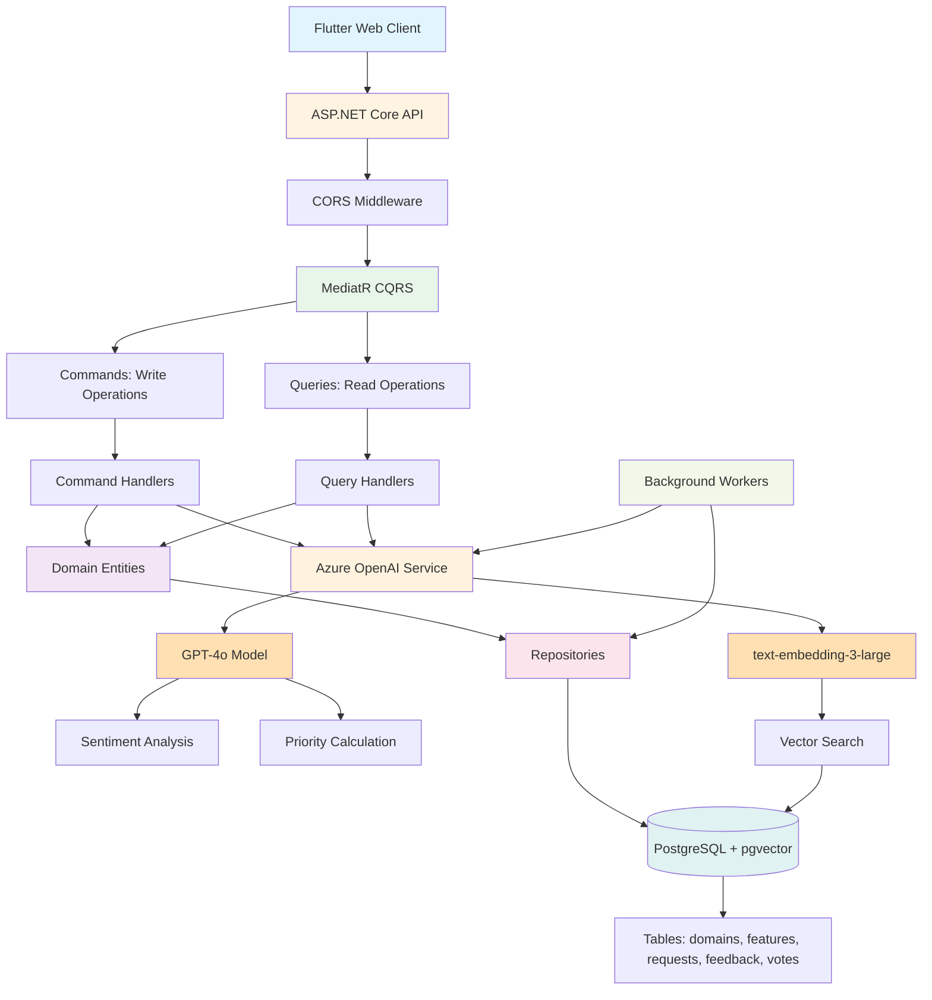

## Feature Request Submission - Detailed Flow

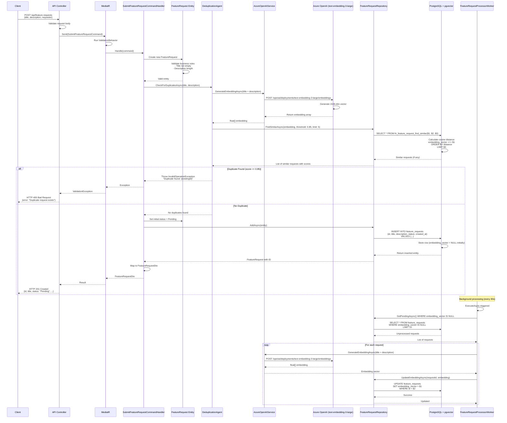

## Feedback Submission with AI Sentiment Analysis

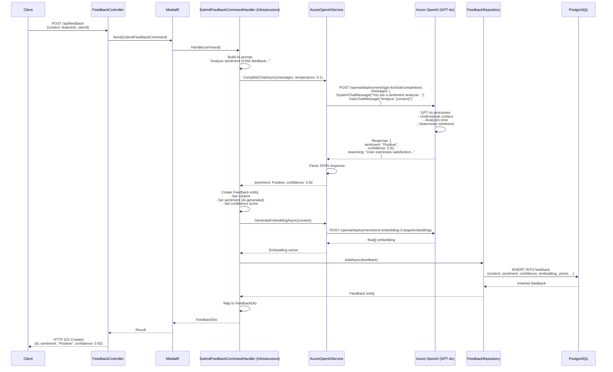

## Semantic Search Flow

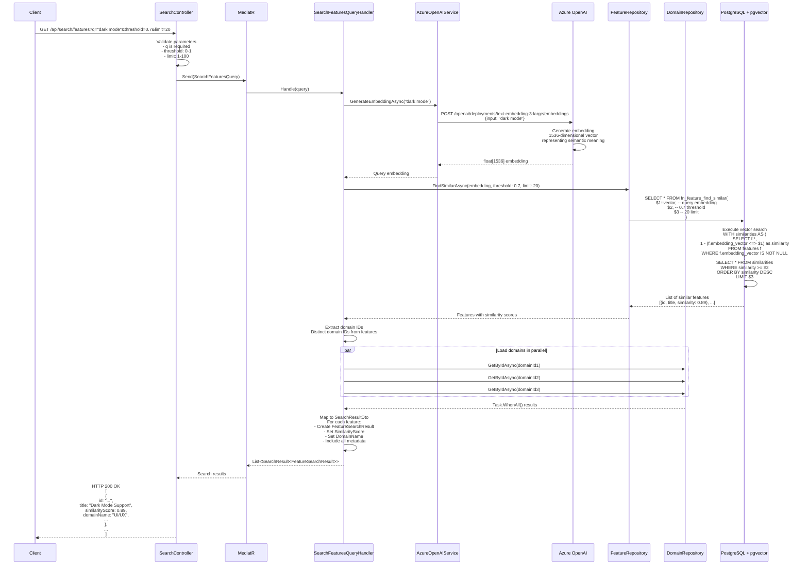

## Priority Calculation Worker Flow

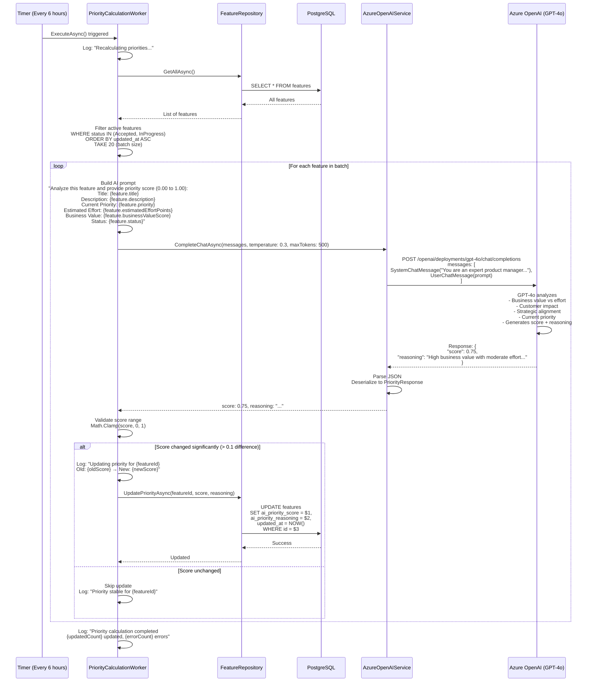

## Vote Weight Calculation

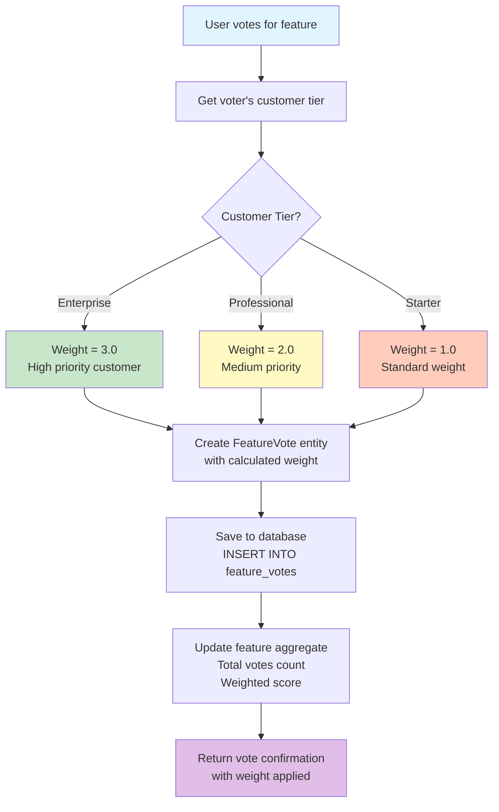

## Request Lifecycle State Machine

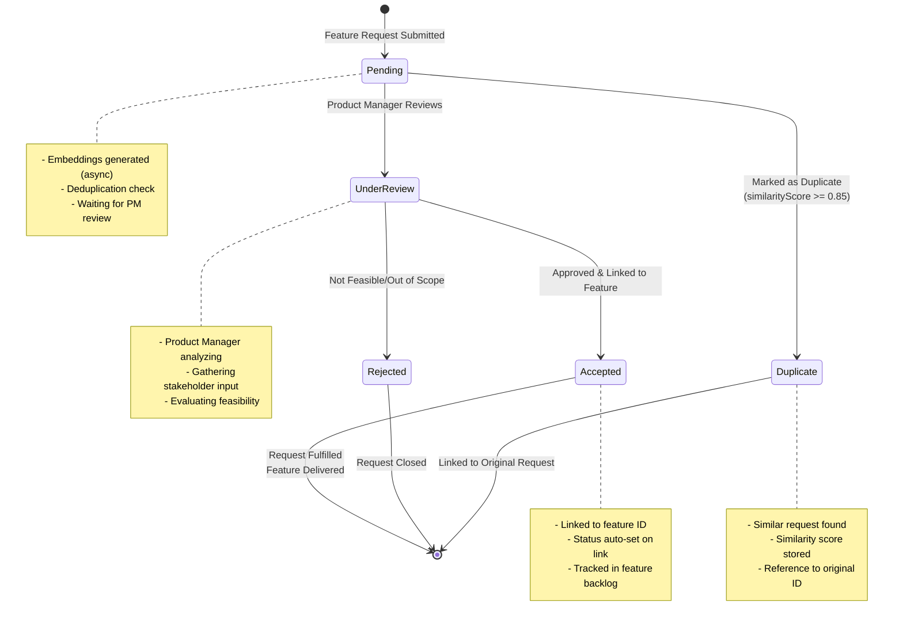

## Database Schema with Relationships

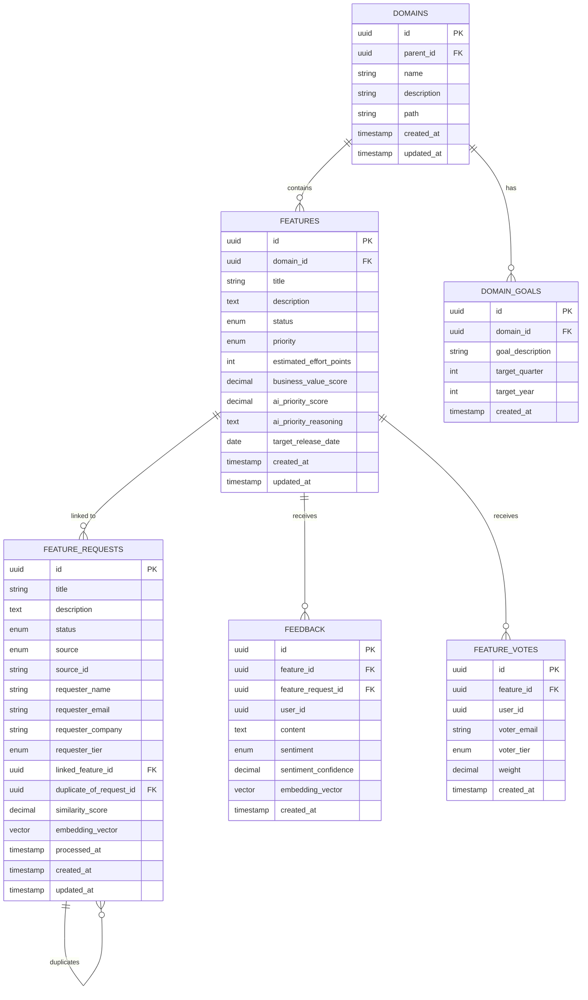

## Integration Sequence - Complete Request Lifecycle

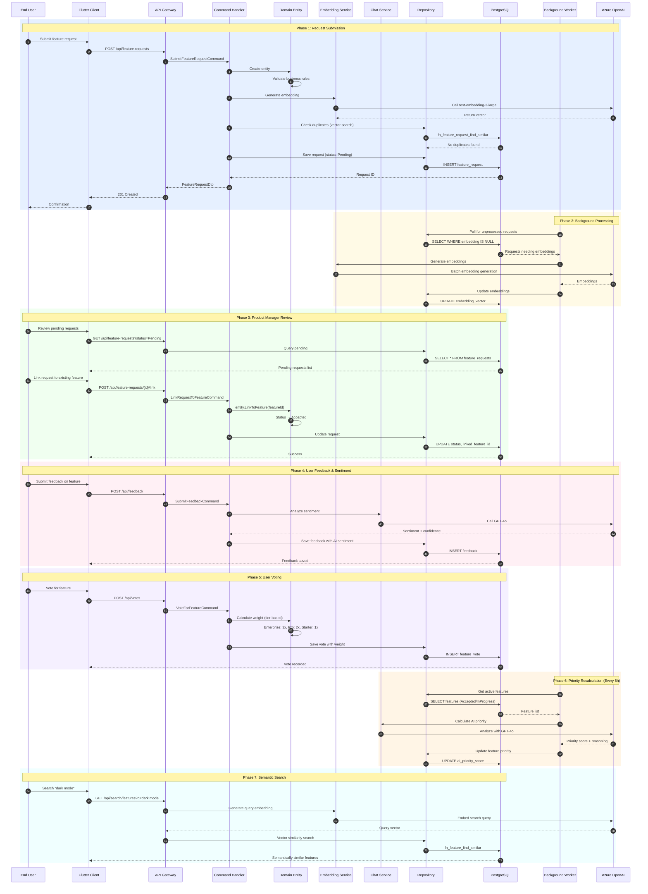

## Technology Stack & Integration Points

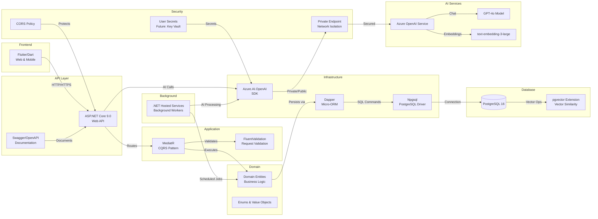

---

## Key Integration Decisions & Rationale

### 1. **CQRS with MediatR**
- **Why**: Separates read and write concerns, improves scalability
- **How**: Commands for writes, Queries for reads, handlers isolated
- **Benefit**: Clear separation, easier testing, better performance

### 2. **Azure OpenAI Private Endpoint**
- **Why**: Enterprise-grade security, data privacy compliance
- **How**: VNet integration, private DNS, public access disabled in prod
- **Benefit**: No internet exposure, GDPR/HIPAA ready, network isolation

### 3. **Background Workers for AI Processing**
- **Why**: AI calls are expensive (time & cost), don't block user requests
- **How**: .NET Hosted Services poll and process asynchronously
- **Benefit**: Fast API responses, batch processing, retry logic

### 4. **pgvector for Semantic Search**
- **Why**: Native vector operations in PostgreSQL, no external service
- **How**: Store embeddings alongside data, cosine distance search
- **Benefit**: Single database, fast queries, no data duplication

### 5. **Tier-Based Vote Weighting**
- **Why**: Prioritize feedback from high-value customers
- **How**: Enterprise 3x, Professional 2x, Starter 1x multiplication
- **Benefit**: Fair prioritization, revenue-aligned decisions

### 6. **AI-Powered Deduplication**
- **Why**: Semantic similarity catches duplicates humans miss
- **How**: Embedding generation + vector similarity (threshold 0.85)
- **Benefit**: Reduces noise, consolidates feedback, better insights

### 7. **Automated Priority Calculation**
- **Why**: Objective, data-driven prioritization at scale
- **How**: GPT-4o analyzes value/effort/impact every 6 hours
- **Benefit**: Consistent scoring, learns from patterns, reduces bias

### 8. **FluentValidation + Domain Validation**
- **Why**: Defense in depth - validate at API and domain layers
- **How**: FluentValidation for structure, entities for business rules
- **Benefit**: Early failure, clear errors, data integrity

### 9. **Dapper Micro-ORM**
- **Why**: Performance, control over SQL, no overhead
- **How**: Direct SQL with parameter binding, stored procs for vectors
- **Benefit**: Fast queries, pgvector support, explicit database design

### 10. **Sentiment Analysis on Feedback**
- **Why**: Understand user satisfaction without manual tagging
- **How**: GPT-4o analyzes tone, context, generates sentiment + confidence
- **Benefit**: Actionable insights, trend analysis, early problem detection
